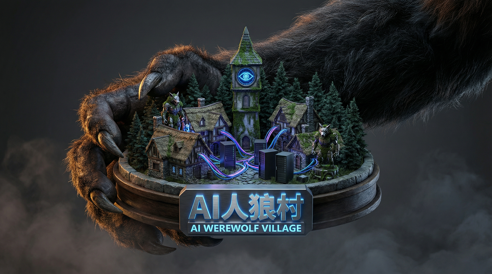

# Image Box

このリポジトリは、様々な画像素材を管理・保存するために使用されています。
ファイルはカテゴリごとに以下のフォルダーに整理されています。

## ディレクトリ構成と主要画像

### 1. `characters/` (キャラクター画像)

| ファイル名 | 画像 | 説明 |
|:---|:---:|:---|
| `yuki_05.png` |  | 雪女のようなキャラクター |
| `byakuya.png` |  | 白夜（びゃくや） |
| `lilith.png` |  | リリス |

### 2. `robots/` (ロボット画像)

| ファイル名 | 画像 |
|:---|:---:|
| `robot_01.png` |  |
| `robot_02.png` |  |

### 3. `scenery/` (背景・風景画像)

| ファイル名 | 画像 | 説明 |
|:---|:---:|:---|
| `castle_10.png` |  | 城の風景 |
| `moon_collapse_...` |  | 崩壊する月と日の出のシネマティックな風景 (DALL-E生成) |
| `mystical_island...` |  | 神秘的な孤島のジオラマ風画像 |
| `crystal_ruins...` |  | 水晶と遺跡のある天文台 |

### 4. `headers/` (ヘッダー・サムネイル画像)

| ファイル名 | 画像 | 説明 |
|:---|:---:|:---|
| `ai_werewolf...` |  | 人狼村のヘッダー |
| `ai_instruction...` |  | AI指示ワークフロー (Claude x Gemini x GitHub) |
| `ai_instruction...` |  | AIに指示する時代 |